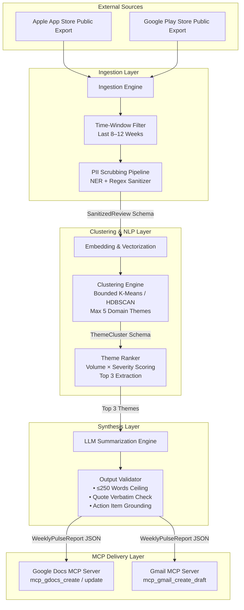

# Review Pulsator — System Architecture Specification

This document (`Architecture.md`) defines the technical architecture, component design, data contracts, and integration workflows for **Review Pulsator**. Designed in accordance with [Context.md](file:///Users/vkg/Desktop/Review%20Pulsator/Docs/Context.md), this specification outlines how the system ingests public store reviews, clusters sentiment, synthesizes executive summaries, and distributes artifacts via the **Model Context Protocol (MCP)**.

---

## 1. Architectural Principles

1. **MCP-First Integration**: External mutations (creating Google Docs, drafting Gmail messages) are strictly executed via standardized MCP tool invocations. The core codebase must contain zero custom OAuth 2.0 authentication flows or direct HTTP REST client boilerplate for Google APIs.
2. **Privacy by Design (Zero-PII)**: Personally Identifiable Information (PII) is purged at the ingestion boundary before any embedding, clustering, or LLM summarization occurs.
3. **Bounded Synthesis**: To guarantee scannability, the summarization engine enforces strict deterministic bounds: maximum 5 clustering themes, Top 3 presentation limit, 3 verbatim quotes, 3 action ideas, and a strict word count ceiling of $\le 250$ words.
4. **Decoupled Analytics & Delivery**: The analytical engine is completely agnostic to the delivery medium, communicating via structured JSON schemas.

---

## 2. High-Level Architecture & System Diagram

The system is organized into four core modular layers: **Ingestion Layer**, **Clustering & NLP Layer**, **Synthesis Layer**, and **MCP Delivery Layer**.



---

## 3. Module & Service Specifications

### 3.1. Ingestion & Preprocessing Module (`IngestionService`)
- **Responsibility**: Connects to public review export files (CSV/JSON/XML) from Apple App Store and Google Play Store.
- **Filtering Logic**: 
  - Restricts review ingestion to a sliding window of **8 to 12 weeks** prior to execution.
  - Filters out reviews with empty body text or non-target languages.
- **PII Scrubbing Pipeline**:
  - Executes a multi-pass NER (Named Entity Recognition) and regular expression scrubber.
  - Anonymizes usernames, email addresses, phone numbers, IP addresses, and device identifiers (replacing them with generic tokens like `[ANONYMIZED_USER]`).

### 3.2. Clustering & Theming Module (`ThemingEngine`)
- **Responsibility**: Groups sanitized reviews into coherent product themes and identifies the top drivers of customer sentiment.
- **Algorithm**:
  - Generates dense semantic embeddings for each review body.
  - Applies a bounded clustering algorithm constrained to a **maximum of 5 themes** mapped to Swiggy domain taxonomies (e.g., *Delivery Speed & Partner Behavior, Order Accuracy & Packaging, Instamart & Grocery Availability, Pricing & Swiggy One Coupons, App Performance & GPS Tracking*).
- **Ranking Metric**:
  - Calculates a composite score for each cluster: $\text{Score} = \text{Volume} \times \text{SentimentSeverityWeight}$.
  - Extracts exactly the **Top 3 scoring clusters** to pass to the synthesis engine.

### 3.3. Pulse Synthesis Module (`PulseGenerator`)
- **Responsibility**: Generates the final one-page executive summary from the top 3 clusters.
- **LLM Prompting Constraints**:
  - **Word Count**: Explicit system instruction enforcing $\le 250$ words.
  - **Real User Quotes**: Must select exactly **3 verbatim review sentences** from the top clusters. The generator verifies quote authenticity by performing an exact substring match against the raw review database.
  - **Action Ideas**: Generates exactly **3 concrete engineering/product recommendations** grounded directly in the top 3 themes.
- **Validation Loop**: If the LLM output exceeds 250 words or contains synthetic quotes, the validator triggers an automatic self-correction retry prompt.

### 3.4. MCP Delivery Module (`MCPIntegrationService`)
- **Responsibility**: Interacts with external Google Workspace surfaces without custom authentication code.
- **Google Docs Tool Invocation**:
  - Invokes `mcp_gdocs_create_document` or `mcp_gdocs_update_document` via the local Google Docs MCP server.
  - Formats the markdown pulse into clean document styling (headers, bold emphasis, blockquotes for user quotes).
- **Gmail Tool Invocation**:
  - Invokes `mcp_gmail_create_draft` via the local Gmail MCP server.
  - Constructs an HTML or plain-text email body containing the pulse summary and a direct hyperlink to the generated Google Doc, addressed to the designated user or team alias.

---

## 4. Core Data Contracts & Schemas

### 4.1. `SanitizedReview` (Post-Ingestion)
```json
{
  "review_id": "play_store_849201",
  "store": "GOOGLE_PLAY",
  "rating": 1,
  "title": "Cold food and late delivery",
  "body": "My order arrived 45 minutes late and the delivery partner GPS tracking was stuck in one place.",
  "submitted_at": "2026-06-15T10:30:00Z",
  "is_pii_scrubbed": true
}
```

### 4.2. `ThemeCluster` (Post-Clustering)
```json
{
  "theme_id": "theme_delivery_speed",
  "theme_name": "Delivery Speed & Partner GPS Glitches",
  "review_count": 142,
  "average_rating": 1.6,
  "rank": 1,
  "representative_quotes": [
    "My order arrived 45 minutes late and the delivery partner GPS tracking was stuck in one place.",
    "Food took over an hour and the Instamart items were missing from the package."
  ]
}
```

### 4.3. `WeeklyPulseReport` (Synthesis Output -> MCP Input)
```json
{
  "report_date": "2026-07-05",
  "word_count": 218,
  "top_themes": [
    { "name": "Delivery Speed & Partner GPS Glitches", "summary": "Users report severe delays during peak dinner hours with GPS tracking freezing on map." },
    { "name": "Instamart Item Stock & Replacements", "summary": "Grocery orders frequently arrive with out-of-stock items missing without prior notification." },
    { "name": "Swiggy One Coupon Application Errors", "summary": "Free delivery discount fails to apply at checkout for active Swiggy One subscribers." }
  ],
  "verbatim_quotes": [
    "My order arrived 45 minutes late and the delivery partner GPS tracking was stuck in one place.",
    "Half my Instamart grocery items were missing and customer care automated bot closed my chat.",
    "Swiggy One free delivery coupon says not applicable even though my membership is active until next year."
  ],
  "action_ideas": [
    "Optimize GPS socket reconnect logic in partner app to prevent live map tracking freezes.",
    "Implement mandatory picker confirmation prompt before dispatching incomplete Instamart grocery orders.",
    "Fix caching race condition in Swiggy One promotion service during checkout coupon validation."
  ]
}
```

---

## 5. Security, Compliance & Observability

### 5.1. Terms of Service (ToS) Compliance
- The ingestion service strictly rejects scraping scraping endpoints that require user authentication or violate store scraping policies. All inputs must originate from official developer console exports or public RSS/API feeds.

### 5.2. Error Handling & MCP Fallbacks
- **MCP Server Unavailable**: If the Google Docs or Gmail MCP server is unreachable, the execution pipeline caches the generated `WeeklyPulseReport` locally in JSON format and logs a high-priority alert without dropping data.
- **Hallucination Detection**: If the synthesis module fails the verbatim quote check after 3 retries, the pipeline falls back to extracting the highest-scoring raw sentence directly from the cluster without LLM rewriting.
