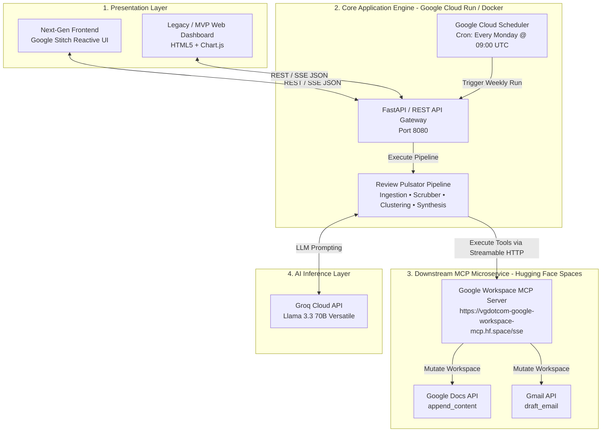

# Review Pulsator — Production Deployment & Frontend Architecture Plan

This document (`Deployment-plan.md`) outlines the authoritative operational blueprint for deploying **Review Pulsator** to production environments. It details containerization strategies, secret management, scheduled cron orchestration, and the roadmap for integrating our next-generation frontend using **Google Stitch**.

---

## 1. Executive Deployment Topology

Review Pulsator operates on a **Decoupled Two-Tier Cloud Architecture**:



---

## 2. Target Deployment Modes

We support two primary production operational models depending on stakeholder requirements:

### Mode A: Automated Serverless Scheduler (Zero-Touch Cron)
Designed for hands-off weekly reporting to executive leadership and product teams.
* **Compute Engine**: **Google Cloud Run Jobs** or **AWS Fargate Tasks**.
* **Trigger Mechanism**: **Google Cloud Scheduler** configured with cron expression `0 9 * * 1` (Every Monday at 9:00 AM UTC).
* **Execution Flow**: Container boots $\rightarrow$ ingests last 8–12 weeks of store reviews $\rightarrow$ runs PII scrubber and clustering $\rightarrow$ calls Groq 70B $\rightarrow$ invokes remote MCP Server to append to Google Docs and draft Gmail notification $\rightarrow$ shuts down (zero idle compute costs).

### Mode B: Decoupled Cloud Production (Vercel + Hugging Face Spaces)
Designed for product managers, UX researchers, and support leads who need real-time exploration and on-demand pulse triggers.
* **Frontend Hosting (Vercel)**: Hosted on **Vercel** (`https://review-pulsator.vercel.app`), serving the `/dashboard` reactive UI bundle. Configured via `vercel.json` with rewrite proxy rules sending `/api/*` traffic cleanly to Hugging Face Spaces without CORS friction.
* **Backend Inference Engine (Hugging Face Spaces)**: Hosted as a Docker SDK Space on **Hugging Face Spaces** listening on port `7860`. Serves `/api/status`, `/api/report`, `/api/analytics`, and `/api/trigger_pulse`.

---

## 3. Environment & Secrets Management

To guarantee zero PII leakage and strict compliance, sensitive credentials must never be hardcoded into container images. All deployments must inject the following configuration parameters via secure vault systems (e.g., **Google Secret Manager**, **Hugging Face Secrets**, or **Infisical**):

| Environment Variable | Requirement | Description / Production Target |
| :--- | :---: | :--- |
| `GROQ_API_KEY` | **Required** | API token for Groq Cloud inference (`llama-3.3-70b-versatile`). |
| `PULSATOR_TARGET_EMAIL` | **Required** | Target recipient email alias for weekly Gmail notifications (e.g., `product-leads@swiggy.in`). |
| `PULSATOR_GDOCS_DOC_ID` | **Required** | Production Google Document ID where weekly pulse notes are appended chronologically. |
| `MCP_SERVER_URL` | **Required** | Remote Streamable HTTP endpoint (`https://vgdotcom-google-workspace-mcp.hf.space/sse`). |
| `PULSATOR_WORD_CEILING` | Optional | Executive note word limit (Default: `250`). |
| `PULSATOR_THEME_LIMIT` | Optional | Bounded domain cluster ceiling (Default: `5`). |
| `PORT` | Optional | HTTP binding port for containerized dashboards (Default: `7860` on Hugging Face Spaces). |

---

## 4. Containerization Strategy (Dockerfile Blueprint)

The core engine is packaged into a hardened, multi-stage Python 3.12 Slim Docker image optimized for Hugging Face Spaces (requiring non-root user UID 1000 and port 7860):

```dockerfile
# Stage 1: Build & Dependency Resolution
FROM python:3.12-slim as builder
WORKDIR /app
RUN apt-get update && apt-get install -y --no-install-recommends build-essential
COPY requirements.txt .
RUN pip wheel --no-cache-dir --no-deps --wheel-dir /app/wheels -r requirements.txt

# Stage 2: Hardened Runtime Container for Hugging Face Spaces
FROM python:3.12-slim as runtime
WORKDIR /app

# Hugging Face Spaces sets PORT=7860 by default
ENV PYTHONUNBUFFERED=1 \
    PYTHONDONTWRITEBYTECODE=1 \
    PORT=7860

# Create non-root system user with UID 1000 (Required by Hugging Face Spaces security policy)
RUN groupadd -g 1000 user && useradd -u 1000 -g user -m user
COPY --from=builder /app/wheels /wheels
COPY --from=builder /app/requirements.txt .
RUN pip install --no-cache /wheels/*

# Copy application source code with proper ownership
COPY --chown=user:user . .
USER user

# Expose port 7860 for Hugging Face Spaces ingress routing
EXPOSE 7860
CMD ["python3", "dashboard_server.py"]
```

---

## 5. Phase 7: Google Stitch Frontend Integration Blueprint

As part of our Post-MVP evolution, we will replace or supplement the MVP vanilla HTML dashboard with a state-of-the-art UI built using **Google Stitch** (Google's advanced UI design and code generation platform).

### 5.1 Objectives of Google Stitch Integration
1. **Next-Gen Reactive Aesthetics**: Utilize Google Stitch to generate ultra-modern, component-driven UI layouts with fluid micro-animations, dynamic glassmorphic panels, and responsive mobile/desktop viewports.
2. **Real-Time Streaming Pulse (SSE)**: Upgrade our REST API to support Server-Sent Events (SSE), allowing the Google Stitch frontend to visually stream the LLM's note generation and vector clustering steps live on screen.
3. **Interactive Taxonomy Explorer**: Build interactive filtering widgets allowing product leads to slice review sentiment by store type (*App Store vs. Play Store*), star rating, or custom taxonomy tags.

### 5.2 API Data Contract for Google Stitch
The Google Stitch frontend will consume our existing, standardized REST JSON contracts:

```typescript
// Example Data Contract expected by Google Stitch components
interface PulseDashboardState {
  server_status: {
    status: "ONLINE" | "OFFLINE";
    model: string;
    word_ceiling: number;
  };
  latest_report: {
    report_date: string;
    word_count: number;
    top_themes: Array<{ name: string; summary: string }>;
    verbatim_quotes: string[];
    action_ideas: string[];
    doc_url: string;
  };
  analytics: {
    total_scrubbed_window: number;
    store_split: { google_play: number; apple_app_store: number };
    rating_distribution: Record<number, number>;
  };
}
```

---

## 6. CI/CD & Automated Verification Pipeline

To ensure absolute reliability, every pull request and production release must pass our automated GitHub Actions CI/CD pipeline:

1. **Linting & Type Checking**: `ruff check .` and `mypy review_pulsator/`.
2. **Automated Unit & Integration Test Suite**: Execute `.venv/bin/pytest tests/ -v`. Must maintain **100% pass rate across all 38 tests** (verifying zero PII leakage, $\le 250$ word ceiling, verbatim quote substrings, and MCP delivery resilience).
3. **Container Build Verification**: Build docker container and execute containerized dry-run pipeline test before deploying to Google Cloud Run.
